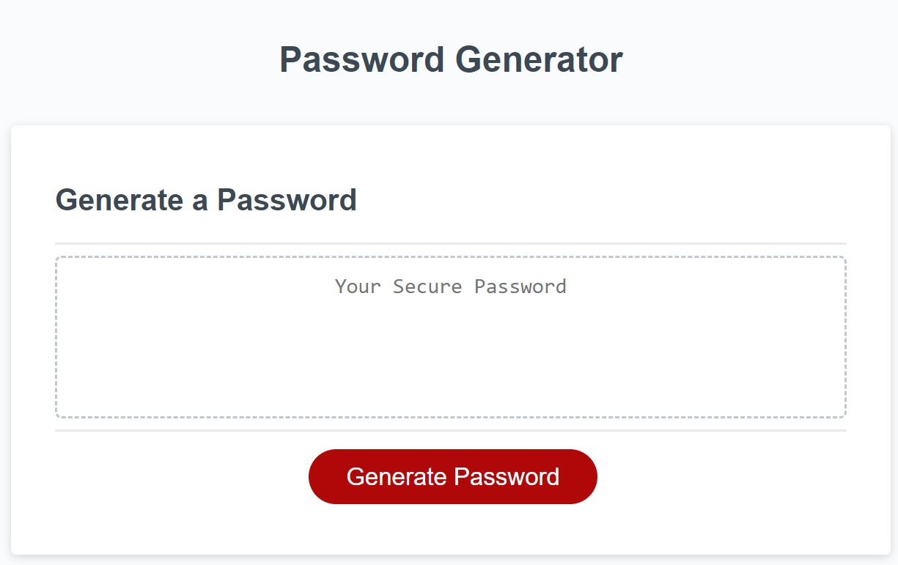

# W5-Password-Generator

## Description

- The app generates a random password for the user.
- The app presents a set of prompt to determine the user's request to include which character type.
- The app validates each input so that at least one character type is selected.
- The app then generates the random password and displays it on the screen.

## Installation
No installation is required. 
Deployed link: https://huihuihui07.github.io/W5-Password-Generator/

